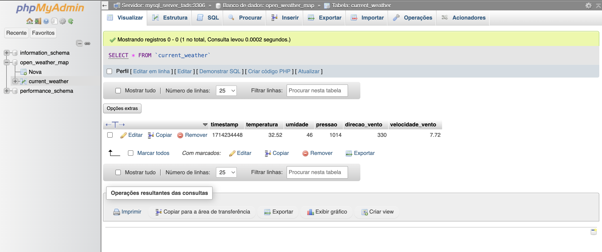

# Desenvolvimento inicial do sistema de coleta de dados climáticos

Criação de um script que realize a coleta e o armazenamento dos dados de interesse (ETL) a um banco de dados relacional (MySQL) a partir da [análise de modelagem do domínio do sistema](https://budkee.notion.site/Open-Weather-Map-3b2e4e5a58ec4898ad31f94c178ca2db?pvs=4).

## Anotações

- Criar um repositório do projeto e outro para o script, de modo que a execução dos containers seja feita estando no repo do projeto.
- A API da OpenWeatherMap fornece 2 opções para o envio do pacote: `json` e `xml`, aqui foi escolhido o `json` para o consumo e posteriormente manipulado com `csv` em pandas.
- **Tem o limite de 60 requisições/dia ou 1.000.000 de requisições/mês, possibilitando implementar um método/padrão de projeto que consiga recolher o máximo de requisições/dia ou mês**.
- Os componentes atuantes nesse sistema são: um servidor linux e Python, um servidor de banco de dados MySQL e uma interface web usando PhpMyAdmin.
- O sistema será executado através de um compose onde cada container docker equivale a um componente do sistema.

## Roteiro do script

1. Consumir a API
2. Armazenamento remoto (MySQL)

### Inputs do serviço

    coleta_armazena.py --coord -20.45 -54.56 --out dados_coletados.json

### Outputs esperado

    coleta_dados_armazena-1  | |-----------1. Consumindo a API--------------|
    coleta_dados_armazena-1  |
    coleta_dados_armazena-1  | Deu bom!
    coleta_dados_armazena-1  | Recolhendo os dados...
    coleta_dados_armazena-1  |
    coleta_dados_armazena-1  |     timestamp  temperatura  umidade  pressao  direcao_vento  velocidade_vento
    coleta_dados_armazena-1  | 0  1714234448        32.52       46     1014            330              7.72
    coleta_dados_armazena-1  |
    coleta_dados_armazena-1  | Tudo certo!
    coleta_dados_armazena-1  |
    coleta_dados_armazena-1  |
    coleta_dados_armazena-1  | |-----------2. Iniciando o armazenamento remoto (MySQL)--------------|
    coleta_dados_armazena-1  |
    coleta_dados_armazena-1  | Conectado com sucesso ao servidor MySQL versão 8.3.0
    coleta_dados_armazena-1  | Conectado ao banco de dados  ('open_weather_map',)
    coleta_dados_armazena-1  |
    coleta_dados_armazena-1  | Criando a tabela 'current_weather'
    coleta_dados_armazena-1  |
    coleta_dados_armazena-1  | Tabela 'current_weather...' criada com sucesso!
    coleta_dados_armazena-1  |
    coleta_dados_armazena-1  | Inserindo os dados...
    coleta_dados_armazena-1  | Commitando as alterações...
    coleta_dados_armazena-1  |
    coleta_dados_armazena-1  | 1 registros inseridos na tabela.
    coleta_dados_armazena-1  |
    coleta_dados_armazena-1  | |-----------Fim do serviço--------------|
    coleta_dados_armazena-1  | |-----------Conexão finalizada--------------|
    coleta_dados_armazena-1 exited with code 0

### Visão do PhpMyAdmin

### Parâmetros do consumo

- unidade de medida utilizada: `metric`
- latitude: `lat`
- longitude: `long`
- linguagem: `pt-br`

## Dados de interesse | Current Weather

- temperatura: `main.temp`
- umidade: `main.humidity`
- pressão atmosférica: `pressure`
- direção do vento: `wind.deg`
- velocidade do vento: `wind.speed`
- timestamp: `dt`

## Links e Referências

### Documentação do Sistema

- [Análise e Modelagem do Sistema | Notion](https://budkee.notion.site/Open-Weather-Map-3b2e4e5a58ec4898ad31f94c178ca2db?pvs=4)
- [Componentes do Sistema | Notion](https://budkee.notion.site/Componentes-de-software-4c32db42b6584c9982c5c0b9314c788b?pvs=4)
- [OpenWeatherMap | Docs](https://openweathermap.org/current)

### Tutoriais

- [Como conectar um script em Python a um banco de dados MySQL](https://youtu.be/FXlixv8Ieoc?si=5U9EPcKSe2ws1xOE)
- [Criar tabela em um banco MySQL com script em Python](https://youtu.be/yMqBfSl53MA?si=g9KJWvnqnD11OQAz)
- [Inserir dados em uma tabela MySQL com script em Python](https://youtu.be/HiK6OZjumew?si=--OkwhEDC8PEU1sv)
- [Realizar consulta a banco de dados MySQL usando o Python](https://youtu.be/GheUY9b_-ww?si=DqYoz97Biu3HfZAL)

### Imagens Docker

- [Alpine | DockerHub](https://hub.docker.com/_/alpine)
- [MySQL | DockerHub](https://hub.docker.com/_/mysql)
- [PhpMyAdmin | DockerHub](https://hub.docker.com/_/phpmyadmin)

### Outros

- [Link desse repositório | GitHub](https://github.com/budkee/coleta_armazenamento_ddd)
- [Próximas implementações | GitHub](backlog.md)
